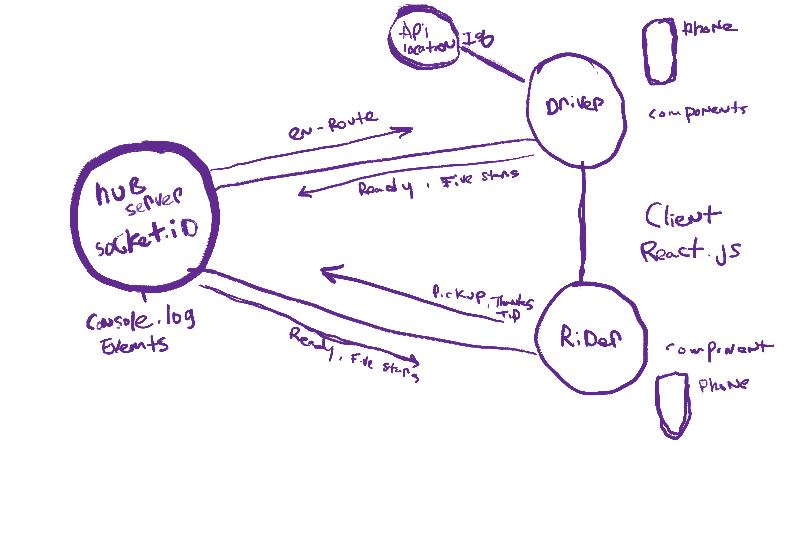

# Class 14 Lab  

## Project: Das Gut Backend socket.io hub

## Authors: Tek Jones and Tyler Johnson

## About
- Create a new application using real-time events

- Our team will be responsible for planning, executing, and presenting an application that showcases an event driven architecture

## Requirements
* A “hub” server that moderates all events
* Multiple “clients” that connect to the hub which can both publish and subscribe to events
* Must operate over a network

#### ENV Requirements
PORT=3001

#### Running the App
npm install socket.io
npm install faker

## start program
- npm start

#### UML
